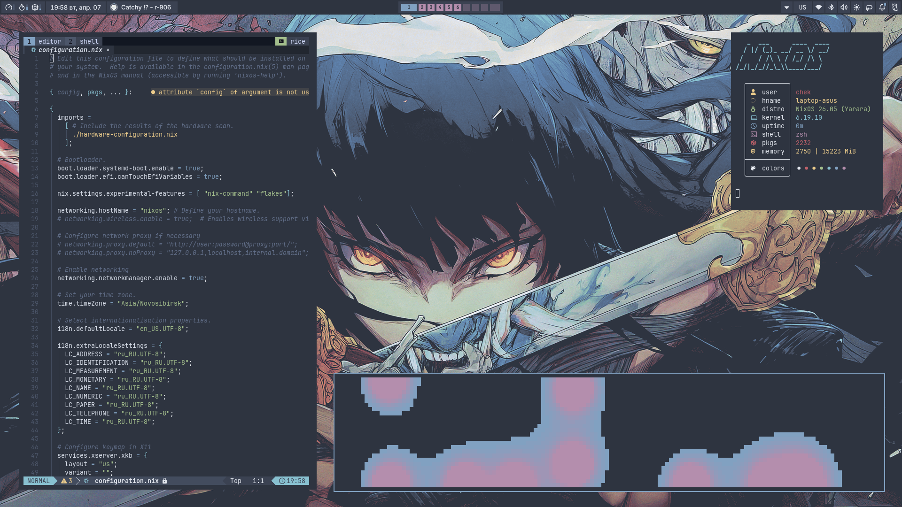
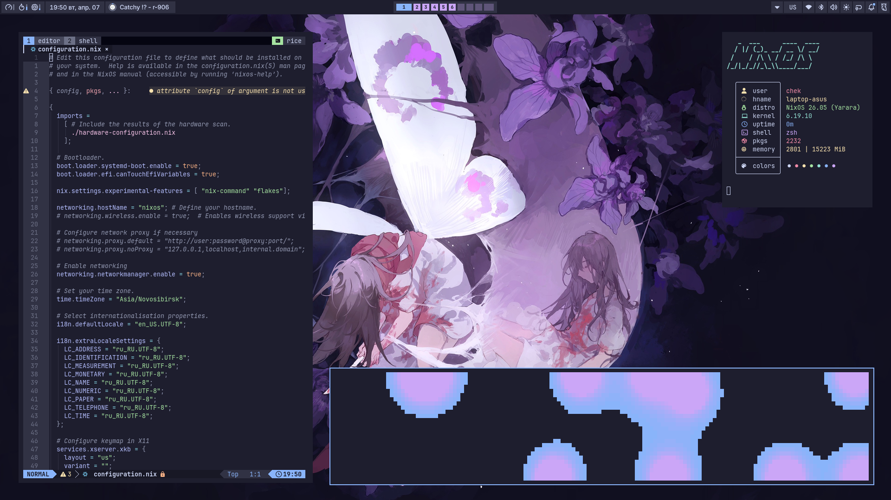
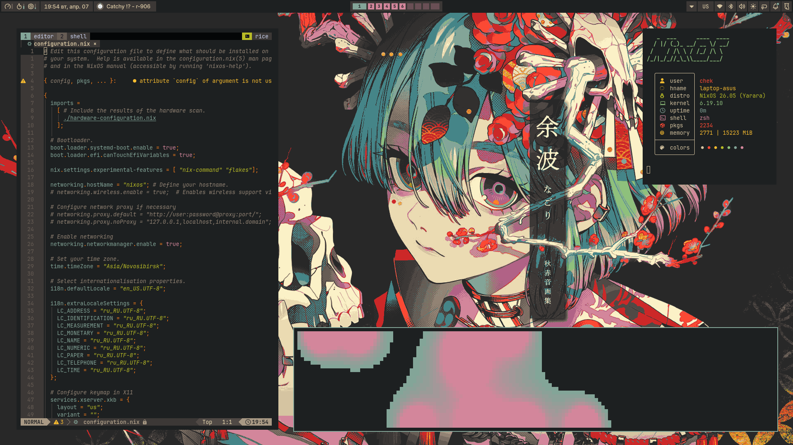

# NixOS Config

My personal NixOS configuration using the **dendritic** modular pattern with [flake-parts](https://github.com/hercules-ci/flake-parts) and [import-tree](https://github.com/vic/import-tree).

## Screenshots





## Features

- **Modular architecture** — self-registering modules organized by category with aggregate profiles
- **Multi-host** — single flake for desktop, laptop (ASUS TUF A15), and WSL
- **Wayland-native** — Niri compositor with Noctalia shell
- **Themes** (Nord, Catppuccin Mocha, Gruvbox Dark Hard) via [Stylix](https://github.com/danth/stylix)
- **Secrets management** with [sops-nix](https://github.com/Mic92/sops-nix)
- **Neovim** configured declaratively through [nvf](https://github.com/NotAShelf/nvf) with 30+ plugins
- **just** commands for all common operations

## Structure

```
.
├── flake.nix                 # Entry point
├── justfile                  # Build/deploy commands
├── modules/
│   ├── flake/                # Core: flake-parts, configurations, system classes
│   │   ├── nixos-classes/    # nixos, wsl, boot, sops, settings, installer
│   │   └── profiles/         # Aggregate profiles (base, desktop, workstation, etc.)
│   ├── hosts/
│   │   ├── desktop-home/     # Desktop with Niri WM
│   │   ├── laptop-asus/      # ASUS TUF A15 laptop (Niri WM + nixos-hardware)
│   │   └── wsl-asuslaptop/   # WSL environment
│   ├── programs/
│   │   ├── cli-tools/        # bat, btop, eza, git, nvim, tmux, yazi, zellij, cmus...
│   │   ├── gui-tools/        # discord, telegram, spicetify, wireshark, mpv, zathura...
│   │   │   ├── gui-browsers/ # firefox, zen, librewolf, qutebrowser, yandex-browser
│   │   │   └── gui-code-editors/ # vscode, sublime
│   │   ├── gaming/           # steam, wine, bottles, lutris, mangohud
│   │   ├── mail/             # thunderbird, aerc
│   │   └── terminals/        # alacritty, kitty, wezterm
│   ├── services/             # docker, wireguard, wireproxy, vopono, networking, virtualization, pttkey, push2talk, throne, zmkbatx
│   ├── hardware/             # bluetooth, power, asus-laptop-hardware, usb-automount, wsl-nvidia
│   ├── shells/               # zsh, nu, direnv
│   ├── desktop-env/          # niri, noctalia, wayland-common
│   └── themes/               # nord, catppuccin-mocha, gruvbox-dark-hard
├── nvf/                      # Neovim configuration via nvf (declarative, 30+ plugins)
│   ├── default.nix           # Entry point
│   ├── keymaps.nix           # Keybindings
│   ├── lsp.nix               # LSP + formatters
│   ├── options.nix           # Vim options
│   ├── package.nix           # Standalone flake package/app
│   └── plugins/              # Plugin configs (snacks, harpoon, flash, blink, etc.)
├── nvim/                     # Legacy Neovim config (lazyvim-nix, kept for reference)
└── secrets/                  # Encrypted secrets (sops)
```

## Profiles

Profiles aggregate related modules to simplify host configs:

| Profile | Includes |
|---------|----------|
| `base` | nord, zsh, cli-tools, dev-tools, docker, terminals |
| `desktop-base` | sops, bluetooth, power, wayland-common |
| `desktop` | base, gui-tools, desktop-base, niri, noctalia, wireshark |
| `dev-tools` | claude-code, direnv, python-dev |
| `workstation` | virtualization, mail, pttkey, usb-automount, zmkbatx |
| `homestation` | workstation, gaming |

## Hosts

| Host | Type | WM | Shell | Profiles & Modules |
|------|------|----|-------|--------------------|
| `desktop-home` | NixOS desktop | Niri | Zsh | desktop, homestation, networking |
| `laptop-asus` | NixOS laptop (ASUS TUF A15) | Niri | Zsh | desktop, homestation, networking, asus-laptop-hardware |
| `wsl-asuslaptop` | WSL | — | Zsh | base, wsl-nvidia, sops, vopono |

## Installation

```bash
# Prerequisites: NixOS installed with flakes enabled - nix.settings.experimental-features = [ "nix-command" "flakes" ];
# https://nixos.org/download/
# https://wiki.nixos.org/wiki/Flakes

# Enter a temporary shell with required tools
nix-shell -p git just fzf

# Clone the repository
git clone https://github.com/chek1337/nixos-config.git ~/nixos-config
cd ~/nixos-config

# Generate hardware config for your machine
just hw <hostname>

# Apply NixOS configuration on next boot + Home Manager now
just bo <hostname>

# Reboot to apply NixOS changes
reboot

# (Optional) Setup sops secrets for encrypted configs
mkdir -p ~/.config/sops/age
nix-shell -p ssh-to-age --run \
  "ssh-to-age -private-key < ~/.ssh/<your-key>" > ~/.config/sops/age/keys.txt
chmod 600 ~/.config/sops/age/keys.txt
```

### Commands

```bash
just              # Show all available commands
just sw <host>    # Apply NixOS + Home Manager configuration
just nsw <host>   # Apply NixOS configuration only
just hm <host>    # Apply Home Manager configuration only
just t <host>     # Test without applying
just b <host>     # Build without applying
just bo <host>    # Apply NixOS on next boot + Home Manager now
just nbo <host>   # Apply NixOS on next boot only
just up           # Update all flake inputs
just up <input>   # Update specific flake input
just gc           # Garbage collect old generations
just fmt          # Format all nix files
just check        # nix flake check
just iso <host>   # Build offline installation ISO
```

All commands have interactive variants via fzf (`swi`, `nswi`, `hmi`, `ti`, `bi`, `boi`, `nboi`, `isoi`, `hwi`, `upi`).

## Standalone Neovim (nvf)

The Neovim configuration is exposed as a standalone flake package and can be used independently — no NixOS required.

### Run without installing

```bash
nix run github:chek1337/nixos-config#nvim
```

### Install to user profile

```bash
nix profile install github:chek1337/nixos-config#nvim
```

### Add to your own flake

```nix
{
  inputs.nixos-config.url = "github:chek1337/nixos-config";

  outputs = { nixos-config, nixpkgs, ... }: {
    # Use the built package directly
    packages.x86_64-linux.nvim = nixos-config.packages.x86_64-linux.nvim;
  };
}
```

## Offline Installation (ISO)

Build an ISO containing all packages for offline NixOS installation on any x86_64 machine.

### Build ISO

```bash
just iso <hostname>
# or interactively:
just isoi
```

Write to USB:
```bash
dd if=result-iso/iso/*.iso of=/dev/sdX bs=4M status=progress
```

### Identify target disk

Boot from USB, then find the target disk:

```bash
lsblk
```

Example output:

```
NAME        MAJ:MIN RM   SIZE RO TYPE MOUNTPOINTS
sda           8:0    1   7.5G  0 disk            # <-- USB installer
├─sda1        8:1    1   3.2G  0 part
└─sda2        8:2    1    50M  0 part
nvme0n1     259:0    0 476.9G  0 disk            # <-- target disk
```

Pick the disk you want to install to — the one that matches the expected size and is **not** the USB installer. The installer is usually a small removable (`RM = 1`) device.

> In the examples below `DISK` is used as a placeholder (e.g. `/dev/sda`, `/dev/nvme0n1`, `/dev/vda`).
> Partitions are referred to as `DISKp1`, `DISKp2`, etc.

### Flake configuration path

The ISO mounts at `/iso`. The flake is available at:

```
/iso/etc/nixos-config
```

> The ISO filesystem is **read-only**. Copy the config to a writable location before making changes:
> ```bash
> cp -r /iso/etc/nixos-config /tmp/nixos-config
> ```
> All commands below use `/tmp/nixos-config` as the working copy.

### Install: Clean Disk

```bash
# Partition
parted /dev/DISK mklabel gpt
parted /dev/DISK mkpart ESP fat32 1MiB 512MiB
parted /dev/DISK set 1 esp on
parted /dev/DISK mkpart swap linux-swap 512MiB 4.5GiB
parted /dev/DISK mkpart nixos ext4 4.5GiB 100%

# Format
mkfs.fat -F32 -n boot /dev/DISKp1
mkswap -L swap /dev/DISKp2
mkfs.ext4 -L nixos /dev/DISKp3

# Mount
mount /dev/DISKp3 /mnt
mount --mkdir /dev/DISKp1 /mnt/boot
swapon /dev/DISKp2

# Copy config from read-only ISO
cp -r /iso/etc/nixos-config /tmp/nixos-config

# Generate hardware config and install
nixos-generate-config --root /mnt --show-hardware-config \
  > /tmp/nixos-config/modules/hosts/<hostname>/_hardware-configuration.nix

nixos-install --flake /tmp/nixos-config#<hostname> --no-channel-copy
# Add --option substitute false to force fully offline install (no internet)

# Set user password
nixos-enter --root /mnt -c 'passwd chek'

reboot
```

### Install: Dual Boot (Windows + NixOS)

Shrink Windows partition first (in Windows Disk Management), then boot from USB:

```bash
lsblk

# Create NixOS partitions in free space (keep existing EFI!)
parted /dev/DISK mkpart swap linux-swap <start> <start+4G>
parted /dev/DISK mkpart nixos ext4 <start+4G> 100%

mkswap -L swap /dev/DISKpX
mkfs.ext4 -L nixos /dev/DISKpY

# Mount (use existing Windows EFI partition)
mount /dev/DISKpY /mnt
mount --mkdir /dev/DISKp1 /mnt/boot    # existing EFI
swapon /dev/DISKpX

# Copy config from read-only ISO
cp -r /iso/etc/nixos-config /tmp/nixos-config

# Generate hardware config and install
nixos-generate-config --root /mnt --show-hardware-config \
  > /tmp/nixos-config/modules/hosts/<hostname>/_hardware-configuration.nix

nixos-install --flake /tmp/nixos-config#<hostname> --no-channel-copy
# Add --option substitute false to force fully offline install (no internet)
nixos-enter --root /mnt -c 'passwd chek'

reboot
```

> systemd-boot will automatically detect Windows Boot Manager on the EFI partition.

## Inspiration

- [Doc-Steve/dendritic-design-with-flake-parts](https://github.com/Doc-Steve/dendritic-design-with-flake-parts)
- [onatustun/nix-config](https://github.com/onatustun/nix-config)
- [TheMaxMur/NixOS-Configuration](https://github.com/TheMaxMur/NixOS-Configuration)
- [khaneliman/khanelinix](https://github.com/khaneliman/khanelinix)
